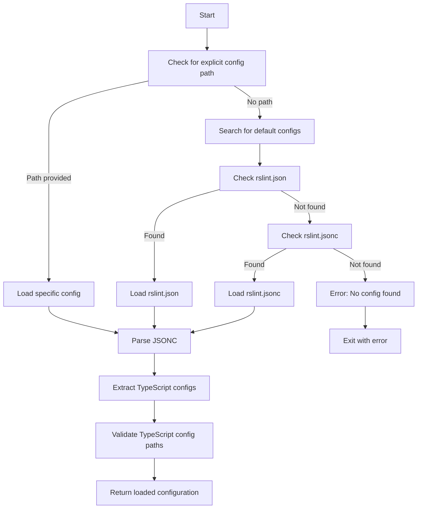

# RSLint Configuration Management Documentation

## 1. Overview

RSLint's configuration management system provides a flexible, hierarchical approach to configuring linting rules, TypeScript integration, and file processing. The system supports both JSON and JSONC (JSON with Comments) formats and follows ESLint-compatible configuration patterns.

## 2. Configuration File Structure

### 2.1 Top-Level Configuration

```go
// RslintConfig represents the top-level configuration array
type RslintConfig []ConfigEntry
```

RSLint uses an array-based configuration format, allowing multiple configuration entries for different file patterns and contexts.

### 2.2 Configuration Entry

```go
type ConfigEntry struct {
    Language        string           `json:"language"`
    Files           []string         `json:"files"`
    Ignores         []string         `json:"ignores,omitempty"`
    LanguageOptions *LanguageOptions `json:"languageOptions,omitempty"`
    Rules           Rules            `json:"rules"`
    Plugins         []string         `json:"plugins,omitempty"`
}
```

**Field Descriptions:**

- **Language**: Target language (e.g., "typescript", "javascript")
- **Files**: Glob patterns for files to include
- **Ignores**: Glob patterns for files to exclude
- **LanguageOptions**: Language-specific configuration
- **Rules**: Rule configuration mapping
- **Plugins**: List of plugin names to load

### 2.3 Language Options

```go
type LanguageOptions struct {
    ParserOptions *ParserOptions `json:"parserOptions,omitempty"`
}

type ParserOptions struct {
    ProjectService bool     `json:"projectService"`
    Project        []string `json:"project,omitempty"`
}
```

**Parser Options:**

- **ProjectService**: Enable TypeScript project service
- **Project**: Array of TypeScript configuration file paths

## 3. Rule Configuration System

### 3.1 Rule Configuration Types

```go
// Flexible rule configuration
type Rules map[string]interface{}

// Type-safe rule configuration
type RuleConfig struct {
    Level   string                 `json:"level,omitempty"`
    Options map[string]interface{} `json:"options,omitempty"`
}
```

### 3.2 Rule Configuration Formats

#### Simple String Format

```json
{
  "rules": {
    "@typescript-eslint/no-unused-vars": "error",
    "@typescript-eslint/prefer-const": "warn",
    "@typescript-eslint/no-explicit-any": "off"
  }
}
```

#### Array Format (ESLint Compatible)

```json
{
  "rules": {
    "@typescript-eslint/no-unused-vars": ["error"],
    "@typescript-eslint/max-params": ["warn", { "max": 4 }],
    "@typescript-eslint/member-ordering": [
      "error",
      {
        "default": ["field", "constructor", "method"]
      }
    ]
  }
}
```

#### Object Format

```json
{
  "rules": {
    "@typescript-eslint/no-unused-vars": {
      "level": "error",
      "options": {
        "argsIgnorePattern": "^_"
      }
    }
  }
}
```

### 3.3 Rule Configuration Methods

```go
// IsEnabled returns true if the rule is enabled (not "off")
func (rc *RuleConfig) IsEnabled() bool {
    if rc == nil {
        return false
    }
    return rc.Level != "off" && rc.Level != ""
}

// GetLevel returns the rule level, defaulting to "error" if not specified
func (rc *RuleConfig) GetLevel() string {
    if rc == nil || rc.Level == "" {
        return "error"
    }
    return rc.Level
}

// GetSeverity returns the diagnostic severity for this rule configuration
func (rc *RuleConfig) GetSeverity() rule.DiagnosticSeverity {
    if rc == nil {
        return rule.SeverityError
    }
    return rule.ParseSeverity(rc.Level)
}
```

## 4. Configuration Loading System

### 4.1 ConfigLoader Structure

```go
type ConfigLoader struct {
    fs               vfs.FS
    currentDirectory string
}

func NewConfigLoader(fs vfs.FS, currentDirectory string) *ConfigLoader {
    return &ConfigLoader{
        fs:               fs,
        currentDirectory: currentDirectory,
    }
}
```

### 4.2 Configuration Loading Methods

#### Load Specific Configuration

```go
func (loader *ConfigLoader) LoadRslintConfig(configPath string) (RslintConfig, string, error) {
    configFileName := tspath.ResolvePath(loader.currentDirectory, configPath)

    if !loader.fs.FileExists(configFileName) {
        return nil, "", fmt.Errorf("rslint config file %q doesn't exist", configFileName)
    }

    data, ok := loader.fs.ReadFile(configFileName)
    if !ok {
        return nil, "", fmt.Errorf("error reading rslint config file %q", configFileName)
    }

    var config RslintConfig
    if err := utils.ParseJSONC([]byte(data), &config); err != nil {
        return nil, "", fmt.Errorf("error parsing rslint config file %q: %w", configFileName, err)
    }

    configDirectory := tspath.GetDirectoryPath(configFileName)
    return config, configDirectory, nil
}
```

#### Load Default Configuration

```go
func (loader *ConfigLoader) LoadDefaultRslintConfig() (RslintConfig, string, error) {
    defaultConfigs := []string{"rslint.json", "rslint.jsonc"}

    for _, defaultConfig := range defaultConfigs {
        defaultConfigPath := tspath.ResolvePath(loader.currentDirectory, defaultConfig)
        if loader.fs.FileExists(defaultConfigPath) {
            return loader.LoadRslintConfig(defaultConfig)
        }
    }

    return nil, "", errors.New("no rslint config file found. Expected rslint.json or rslint.jsonc")
}
```

### 4.3 TypeScript Configuration Integration

```go
func (loader *ConfigLoader) LoadTsConfigsFromRslintConfig(rslintConfig RslintConfig, configDirectory string) ([]string, error) {
    tsConfigs := []string{}

    for _, entry := range rslintConfig {
        if entry.LanguageOptions == nil || entry.LanguageOptions.ParserOptions == nil {
            continue
        }

        for _, config := range entry.LanguageOptions.ParserOptions.Project {
            tsconfigPath := tspath.ResolvePath(configDirectory, config)

            if !loader.fs.FileExists(tsconfigPath) {
                return nil, fmt.Errorf("tsconfig file %q doesn't exist", tsconfigPath)
            }

            tsConfigs = append(tsConfigs, tsconfigPath)
        }
    }

    if len(tsConfigs) == 0 {
        return nil, errors.New("no TypeScript configuration found in rslint config")
    }

    return tsConfigs, nil
}
```

## 5. Rule Registry Integration

### 5.1 Rule Registry Structure

```go
type RuleRegistry struct {
    rules map[string]rule.Rule
}

func NewRuleRegistry() *RuleRegistry {
    return &RuleRegistry{
        rules: make(map[string]rule.Rule),
    }
}
```

### 5.2 Rule Registration

```go
func (r *RuleRegistry) Register(ruleName string, ruleImpl rule.Rule) {
    r.rules[ruleName] = ruleImpl
}

func (r *RuleRegistry) GetRule(name string) (rule.Rule, bool) {
    rule, exists := r.rules[name]
    return rule, exists
}
```

### 5.3 Configuration-Based Rule Filtering

```go
func (r *RuleRegistry) GetEnabledRules(config RslintConfig, filePath string) []linter.ConfiguredRule {
    enabledRuleConfigs := config.GetRulesForFile(filePath)
    var enabledRules []linter.ConfiguredRule

    for ruleName, ruleConfig := range enabledRuleConfigs {
        if ruleConfig.IsEnabled() {
            if ruleImpl, exists := r.rules[ruleName]; exists {
                ruleConfigCopy := ruleConfig
                enabledRules = append(enabledRules, linter.ConfiguredRule{
                    Name:     ruleName,
                    Severity: ruleConfig.GetSeverity(),
                    Run: func(ctx rule.RuleContext) rule.RuleListeners {
                        return ruleImpl.Run(ctx, ruleConfigCopy.Options)
                    },
                })
            }
        }
    }

    return enabledRules
}
```

## 6. Configuration Examples

### 6.1 Basic Configuration

```json
[
  {
    "language": "typescript",
    "files": ["src/**/*.ts", "src/**/*.tsx"],
    "ignores": ["src/**/*.test.ts", "src/**/*.spec.ts"],
    "languageOptions": {
      "parserOptions": {
        "project": ["./tsconfig.json"]
      }
    },
    "rules": {
      "@typescript-eslint/no-unused-vars": "error",
      "@typescript-eslint/prefer-const": "warn",
      "@typescript-eslint/no-explicit-any": "off"
    }
  }
]
```

### 6.2 Multi-Context Configuration

```json
[
  {
    "language": "typescript",
    "files": ["src/**/*.ts"],
    "languageOptions": {
      "parserOptions": {
        "project": ["./tsconfig.json"]
      }
    },
    "rules": {
      "@typescript-eslint/no-unused-vars": "error",
      "@typescript-eslint/strict-boolean-expressions": "error"
    }
  },
  {
    "language": "typescript",
    "files": ["tests/**/*.ts"],
    "languageOptions": {
      "parserOptions": {
        "project": ["./tests/tsconfig.json"]
      }
    },
    "rules": {
      "@typescript-eslint/no-unused-vars": "warn",
      "@typescript-eslint/no-explicit-any": "off"
    }
  }
]
```

### 6.3 Advanced Rule Configuration

```json
[
  {
    "language": "typescript",
    "files": ["src/**/*.ts"],
    "languageOptions": {
      "parserOptions": {
        "project": ["./tsconfig.json"]
      }
    },
    "rules": {
      "@typescript-eslint/no-unused-vars": [
        "error",
        {
          "argsIgnorePattern": "^_",
          "varsIgnorePattern": "^_",
          "caughtErrorsIgnorePattern": "^_"
        }
      ],
      "@typescript-eslint/member-ordering": [
        "error",
        {
          "default": [
            "public-static-field",
            "protected-static-field",
            "private-static-field",
            "public-instance-field",
            "protected-instance-field",
            "private-instance-field",
            "constructor",
            "public-method",
            "protected-method",
            "private-method"
          ]
        }
      ],
      "@typescript-eslint/max-params": ["warn", { "max": 4 }]
    }
  }
]
```

## 7. Configuration Validation

### 7.1 File Pattern Validation

```go
func validateFilePatterns(patterns []string) error {
    for _, pattern := range patterns {
        if _, err := doublestar.Match(pattern, ""); err != nil {
            return fmt.Errorf("invalid glob pattern %q: %w", pattern, err)
        }
    }
    return nil
}
```

### 7.2 Rule Configuration Validation

```go
func parseArrayRuleConfig(ruleArray []interface{}) *RuleConfig {
    if len(ruleArray) == 0 {
        return nil
    }

    // First element should always be the severity level
    level, ok := ruleArray[0].(string)
    if !ok {
        return nil
    }

    ruleConfig := &RuleConfig{Level: level}

    // Second element (if present) should be the options object
    if len(ruleArray) > 1 {
        if options, ok := ruleArray[1].(map[string]interface{}); ok {
            ruleConfig.Options = options
        }
    }

    return ruleConfig
}
```

## 8. Configuration Merging and Inheritance

### 8.1 File-Based Rule Resolution

```go
func (config RslintConfig) GetRulesForFile(filePath string) map[string]*RuleConfig {
    rules := make(map[string]*RuleConfig)

    for _, entry := range config {
        if matchesFilePatterns(filePath, entry.Files) && !matchesIgnorePatterns(filePath, entry.Ignores) {
            for ruleName, ruleValue := range entry.Rules {
                if parsedRule := parseRuleValue(ruleValue); parsedRule != nil {
                    rules[ruleName] = parsedRule
                }
            }
        }
    }

    return rules
}
```

### 8.2 Pattern Matching

```go
func matchesFilePatterns(filePath string, patterns []string) bool {
    for _, pattern := range patterns {
        if matched, _ := doublestar.Match(pattern, filePath); matched {
            return true
        }
    }
    return false
}

func matchesIgnorePatterns(filePath string, ignorePatterns []string) bool {
    for _, pattern := range ignorePatterns {
        if matched, _ := doublestar.Match(pattern, filePath); matched {
            return true
        }
    }
    return false
}
```

## 9. Global Configuration Management

### 9.1 Global Registry

```go
// Global rule registry instance
var GlobalRuleRegistry = NewRuleRegistry()
```

### 9.2 Plugin Registration

```go
func RegisterAllTypeScriptEslintPluginRules() {
    rules := getAllTypeScriptEslintPluginRules()
    for _, rule := range rules {
        GlobalRuleRegistry.Register(rule.Name, rule)
    }
}

func GetAllRulesForPlugin(plugin string) []rule.Rule {
    if plugin == "@typescript-eslint" {
        return getAllTypeScriptEslintPluginRules()
    }
    return []rule.Rule{}
}
```

## 10. Configuration Loading Workflow

### 10.1 Standard Loading Process



### 10.2 Fallback Loading

```go
func LoadConfigurationWithFallback(configPath string, currentDirectory string, fs vfs.FS) (RslintConfig, []string, string) {
    loader := NewConfigLoader(fs, currentDirectory)

    rslintConfig, tsConfigs, configDirectory, err := loader.LoadConfiguration(configPath)
    if err != nil {
        fmt.Fprintf(os.Stderr, "error: %v\n", err)
        os.Exit(1)
    }

    return rslintConfig, tsConfigs, configDirectory
}
```

## 11. Error Handling and Diagnostics

### 11.1 Configuration Errors

- **File Not Found**: Clear error messages for missing configuration files
- **Parse Errors**: JSONC parsing errors with line/column information
- **Validation Errors**: Rule configuration validation failures
- **TypeScript Config Errors**: Missing or invalid TypeScript configuration files

### 11.2 Error Recovery

- **Graceful Degradation**: Continue with partial configuration when possible
- **Default Values**: Sensible defaults for missing configuration options
- **Validation Warnings**: Non-fatal warnings for questionable configurations

This configuration management system provides a robust, flexible foundation for RSLint's rule configuration while maintaining compatibility with ESLint patterns and supporting advanced TypeScript integration scenarios.
