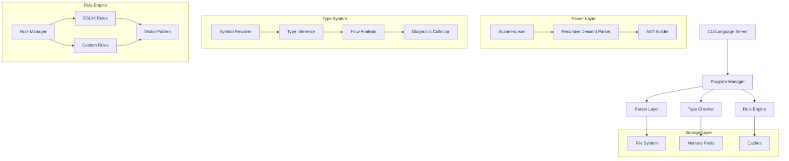
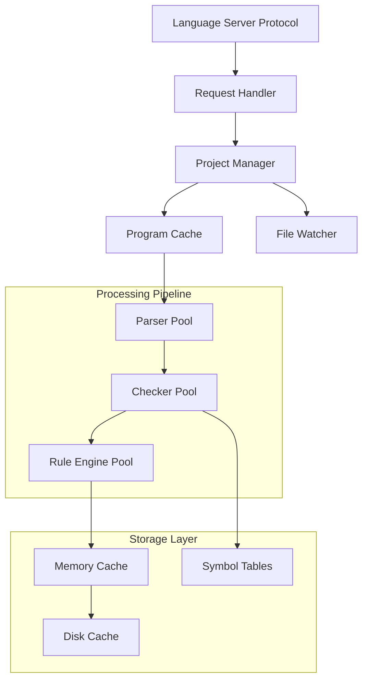
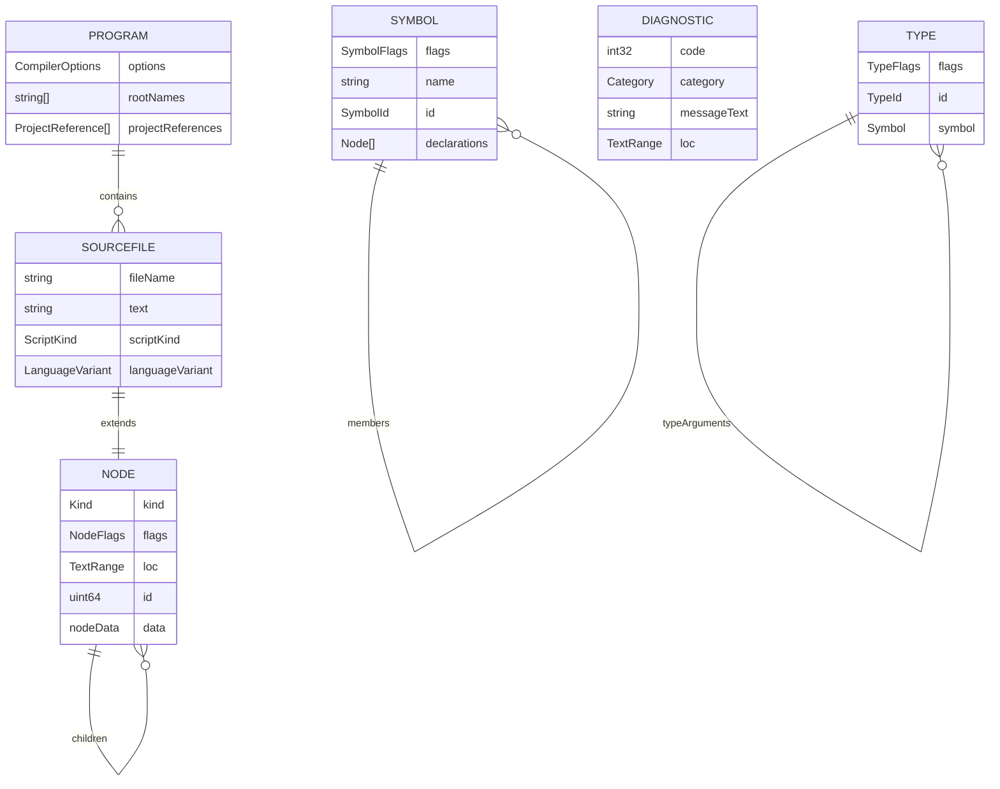

# RSLint TypeScript-Go Technical Architecture Document

## 1. Architecture Design



## 2. Technology Description

- **Core Language**: Go 1.21+
- **Parser**: Custom recursive descent parser
- **AST**: Immutable tree structure with visitor pattern
- **Type System**: Full TypeScript type inference and checking
- **Memory Management**: Object pooling and string interning
- **Concurrency**: Goroutine-based parallel processing
- **Storage**: Virtual file system abstraction
- **Testing**: Go testing framework with comprehensive test suites

## 3. Route Definitions

N/A - This is a compiler/linter system, not a web application.

## 4. API Definitions

### 4.1 Core Parser API

**Parse Source File**

```go
func ParseSourceFile(opts SourceFileParseOptions, sourceText string, scriptKind ScriptKind) *SourceFile
```

Request Parameters:
| Param Name | Param Type | Required | Description |
|------------|------------|----------|-------------|
| opts | SourceFileParseOptions | true | Parsing configuration options |
| sourceText | string | true | Source code content to parse |
| scriptKind | ScriptKind | true | Type of script (TS, JS, JSX, etc.) |

Response:
| Param Name | Param Type | Description |
|------------|------------|-------------|
| result | \*SourceFile | Parsed AST root node |

**Type Check Program**

```go
func (c *Checker) GetSemanticDiagnostics(sourceFile *SourceFile) []*Diagnostic
```

Request Parameters:
| Param Name | Param Type | Required | Description |
|------------|------------|----------|-------------|
| sourceFile | \*SourceFile | true | AST to type check |

Response:
| Param Name | Param Type | Description |
|------------|------------|-------------|
| diagnostics | []\*Diagnostic | List of type errors and warnings |

### 4.2 Rule Engine API

**Execute Rules**

```go
func (re *RuleEngine) ExecuteRules(sourceFile *SourceFile, rules []Rule) []*RuleDiagnostic
```

Request Parameters:
| Param Name | Param Type | Required | Description |
|------------|------------|----------|-------------|
| sourceFile | \*SourceFile | true | AST to analyze |
| rules | []Rule | true | List of rules to execute |

Response:
| Param Name | Param Type | Description |
|------------|------------|-------------|
| diagnostics | []\*RuleDiagnostic | Rule violation reports |

### 4.3 Symbol Resolution API

**Resolve Symbol**

```go
func (c *Checker) GetSymbolAtLocation(node *Node) *Symbol
```

Request Parameters:
| Param Name | Param Type | Required | Description |
|------------|------------|----------|-------------|
| node | \*Node | true | AST node to resolve |

Response:
| Param Name | Param Type | Description |
|------------|------------|-------------|
| symbol | \*Symbol | Resolved symbol information |

## 5. Server Architecture Diagram



## 6. Data Model

### 6.1 Data Model Definition



### 6.2 Data Definition Language

**AST Node Structure**

```go
// Core AST node structure
type Node struct {
    Kind   Kind              // Node type identifier
    Flags  NodeFlags         // Node-specific flags
    Loc    core.TextRange    // Source location
    id     atomic.Uint64     // Unique identifier
    Parent *Node             // Parent reference
    data   nodeData          // Type-specific data
}

// Node kind enumeration
type Kind int16
const (
    KindUnknown Kind = iota
    KindEndOfFile
    KindSingleLineCommentTrivia
    // ... 300+ node kinds
)

// Node flags for metadata
type NodeFlags int32
const (
    NodeFlagsNone                    NodeFlags = 0
    NodeFlagsLet                     NodeFlags = 1 << 0
    NodeFlagsConst                   NodeFlags = 1 << 1
    NodeFlagsNestedNamespace         NodeFlags = 1 << 2
    // ... additional flags
)
```

**Symbol System**

```go
// Symbol representation
type Symbol struct {
    Flags                        SymbolFlags
    CheckFlags                   CheckFlags
    Name                         string
    Declarations                 []*Node
    ValueDeclaration             *Node
    Members                      SymbolTable
    Exports                      SymbolTable
    GlobalExports                SymbolTable
    Id                           SymbolId
    MergeId                      SymbolId
    Parent                       *Symbol
    ExportSymbol                 *Symbol
    ConstEnumOnlyModule          bool
    IsReferenced                 SymbolFlags
    IsReplaceableByMethod        bool
    IsAssigned                   bool
    AssignmentDeclarationMembers SymbolTable
}

// Symbol flags
type SymbolFlags int32
const (
    SymbolFlagsNone                    SymbolFlags = 0
    SymbolFlagsFunction                SymbolFlags = 1 << 0
    SymbolFlagsVariable                SymbolFlags = 1 << 1
    SymbolFlagsProperty                SymbolFlags = 1 << 2
    // ... additional symbol types
)
```

**Type System**

```go
// Type representation
type Type struct {
    Flags      TypeFlags
    Id         TypeId
    Symbol     *Symbol
    Pattern    *DestructuringPattern
    AliasSymbol *Symbol
    AliasTypeArguments []*Type
    data       typeData
}

// Type flags
type TypeFlags int64
const (
    TypeFlagsAny                    TypeFlags = 1 << 0
    TypeFlagsUnknown                TypeFlags = 1 << 1
    TypeFlagsString                 TypeFlags = 1 << 2
    TypeFlagsNumber                 TypeFlags = 1 << 3
    // ... all TypeScript types
)
```

**Diagnostic System**

```go
// Diagnostic structure
type Diagnostic struct {
    file               *SourceFile
    loc                core.TextRange
    code               int32
    category           diagnostics.Category
    messageText        string
    relatedInformation []*DiagnosticRelatedInformation
    source             string
    reportsUnnecessary bool
    reportsDeprecated  bool
    skippedOn          string
}

// Diagnostic categories
type Category int
const (
    CategoryWarning Category = iota
    CategoryError
    CategorySuggestion
    CategoryMessage
)
```

**Parser State**

```go
// Parser structure
type Parser struct {
    scanner *scanner.Scanner
    factory NodeFactory

    opts       SourceFileParseOptions
    sourceText string

    scriptKind       core.ScriptKind
    languageVariant  core.LanguageVariant
    diagnostics      []*Diagnostic
    jsdocDiagnostics []*Diagnostic

    token                       Kind
    sourceFlags                 NodeFlags
    contextFlags                NodeFlags
    parsingContexts             ParsingContexts
    statementHasAwaitIdentifier bool
    hasDeprecatedTag            bool
    hasParseError               bool

    identifiers                map[string]string
    identifierCount            int
    notParenthesizedArrow      collections.Set[int]
    nodeSlicePool              core.Pool[*Node]
    stringSlicePool            core.Pool[string]
    jsdocCache                 map[*Node][]*Node
    possibleAwaitSpans         []int
    jsdocCommentsSpace         []string
    jsdocCommentRangesSpace    []CommentRange
    jsdocTagCommentsSpace      []string
    jsdocTagCommentsPartsSpace []*Node
    reparseList                []*Node
    commonJSModuleIndicator    *Node

    currentParent        *Node
    setParentFromContext Visitor
}
```

**Compiler Options**

```go
// Comprehensive compiler configuration
type CompilerOptions struct {
    AllowJs                           *bool
    AllowSyntheticDefaultImports      *bool
    AllowUmdGlobalAccess              *bool
    AllowUnreachableCode              *bool
    AllowUnusedLabels                 *bool
    AlwaysStrict                      *bool
    BaseUrl                           *string
    Charset                           *string
    CheckJs                           *bool
    Declaration                       *bool
    DeclarationDir                    *string
    DisableSizeLimit                  *bool
    DownlevelIteration                *bool
    EmitBOM                           *bool
    EmitDecoratorMetadata             *bool
    ExactOptionalPropertyTypes        *bool
    ExperimentalDecorators            *bool
    ForceConsistentCasingInFileNames  *bool
    ImportHelpers                     *bool
    ImportsNotUsedAsValues            *ImportsNotUsedAsValues
    InlineSourceMap                   *bool
    InlineSources                     *bool
    IsolatedModules                   *bool
    Jsx                               *JsxEmit
    JsxFactory                        *string
    JsxFragmentFactory                *string
    JsxImportSource                   *string
    KeyofStringsOnly                  *bool
    Lib                               []string
    Locale                            *string
    MapRoot                           *string
    MaxNodeModuleJsDepth              *int
    Module                            *ModuleKind
    ModuleResolution                  *ModuleResolutionKind
    NewLine                           *NewLineKind
    NoEmit                            *bool
    NoEmitHelpers                     *bool
    NoEmitOnError                     *bool
    NoErrorTruncation                 *bool
    NoFallthroughCasesInSwitch        *bool
    NoImplicitAny                     *bool
    NoImplicitOverride                *bool
    NoImplicitReturns                 *bool
    NoImplicitThis                    *bool
    NoImplicitUseStrict               *bool
    NoLib                             *bool
    NoResolve                         *bool
    NoStrictGenericChecks             *bool
    NoUncheckedIndexedAccess          *bool
    NoUnusedLocals                    *bool
    NoUnusedParameters                *bool
    Out                               *string
    OutDir                            *string
    OutFile                           *string
    Paths                             map[string][]string
    PreserveConstEnums                *bool
    PreserveSymlinks                  *bool
    PreserveValueImports              *bool
    Project                           *string
    ReactNamespace                    *string
    RemoveComments                    *bool
    ResolveJsonModule                 *bool
    RootDir                           *string
    RootDirs                          []string
    SkipDefaultLibCheck               *bool
    SkipLibCheck                      *bool
    SourceMap                         *bool
    SourceRoot                        *string
    Strict                            *bool
    StrictBindCallApply               *bool
    StrictFunctionTypes               *bool
    StrictNullChecks                  *bool
    StrictPropertyInitialization     *bool
    StripInternal                     *bool
    SuppressExcessPropertyErrors      *bool
    SuppressImplicitAnyIndexErrors    *bool
    Target                            *ScriptTarget
    TraceResolution                   *bool
    TypeRoots                         []string
    Types                             []string
    UseDefineForClassFields           *bool
    UseUnknownInCatchVariables        *bool
    VerbatimModuleSyntax              *bool

    // Internal options
    ConfigFilePath                    *string
    ConfigFile                        *TsConfigSourceFile
    ProjectReferences                 []*ProjectReference
}
```

**Memory Management**

```go
// Object pooling for performance
type Pool[T any] struct {
    pool sync.Pool
    new  func() T
}

// Node factory with pooling
type NodeFactory struct {
    hooks                             NodeFactoryHooks
    arrayTypeNodePool                 core.Pool[ArrayTypeNode]
    binaryExpressionPool              core.Pool[BinaryExpression]
    blockPool                         core.Pool[Block]
    callExpressionPool                core.Pool[CallExpression]
    // ... pools for all node types
    nodeCount int
    textCount int
}

// String interning for memory efficiency
type StringInterner struct {
    table map[string]string
    mutex sync.RWMutex
}
```

This technical architecture provides a complete foundation for understanding the RSLint TypeScript-Go system's implementation details, data structures, and API interfaces.
